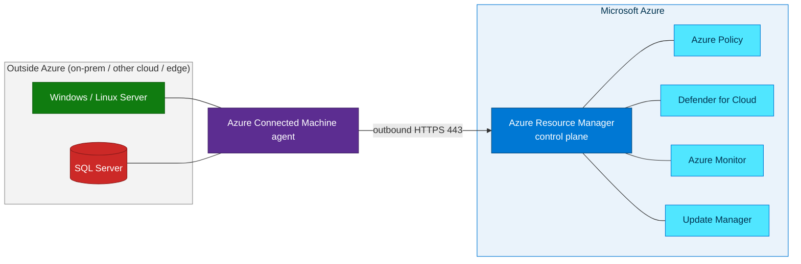

## Workshop overview

This self-paced workshop teaches how Azure Arc extends Azure management, governance,
security, and data services to infrastructure running outside Azure. You begin with
the control-plane model, connect Azure Arc capabilities to real operational outcomes,
and finish by onboarding Windows Server and SQL Server with repeatable automation.

The content progresses from **L100 fundamentals** to an **L400 build lab**. Complete
the labs in order if you are new to Azure Arc, or use the lab metadata to select the
level that matches your role and experience.

## Workshop objectives

After completing the workshop, you will be able to:

1. Explain how Azure Arc projects external resources into Azure Resource Manager.
2. Map Azure Arc to governance, security, monitoring, patching, and SQL use cases.
3. Onboard a Windows Server with the Azure Connected Machine agent.
4. Register and validate SQL Server enabled by Azure Arc.
5. Run a guarded PowerShell deployment and verify the Arc resources in Azure.
6. Choose an appropriate Arc SQL license type for inventory or advanced capabilities.

## Workshop labs

Four progressive levels (L100 → L400). Beginners can start at L100; experienced
practitioners can jump straight to the L400 build lab.

<div class="lab-cards">


  <a class="lab-card" href="{{ lab.url | relative_url }}">
    <span class="lab-card__level">L{{ lab.level }}</span>
    <div class="lab-card__title">{{ lab.title }}</div>
    <div class="lab-card__desc">{{ lab.excerpt }}</div>
  </a>

</div>

## What you will learn

This workshop takes you from zero knowledge to a fully working hands-on lab.


*The Azure Arc control plane projects resources hosted outside Azure into Azure Resource Manager. Source: Microsoft Learn.*

## Who is this for?

- **IT professionals / infrastructure admins** new to Azure Arc (L100–L200).
- **Cloud engineers and architects** who want a repeatable, scriptable build (L300–L400).

## Prerequisites

- An **Azure subscription** with permission to create resource groups and resources.
- **Owner** or **Contributor** + **User Access Administrator** on the target scope.
- [Azure CLI](https://learn.microsoft.com/cli/azure/install-azure-cli) 2.53+ (or [Azure Cloud Shell](https://shell.azure.com)).
- Basic familiarity with the Azure portal and a terminal.

This workshop targets the **Indonesia Central** (`indonesiacentral`) region so resource
metadata stays in-country. You can substitute any
[supported Arc region](https://learn.microsoft.com/azure/azure-arc/servers/overview#supported-regions).
{: .notice--info}

## Start the workshop

### Step 1 — Clone the repository

```bash
git clone https://github.com/ibranibeny/azure-arc-workshop.git
cd azure-arc-workshop
```

### Step 2 — Sign in and select your subscription

```bash
az login
az account set --subscription "<subscription-id-or-name>"
az account show --output table
```

### Step 3 — Begin with the fundamentals

Open [Lab 01 — Azure Arc Overview]({{ '/labs/01-arc-overview/' | relative_url }}),
then use **Next** at the bottom of each lab to continue through the learning path.

### Step 4 — Run the build lab

When you reach Lab 04, choose the deployment that matches your licensing goal:

| Deployment | Script | Arc SQL license | BPA eligibility |
|------------|--------|-----------------|-----------------|
| Evaluation inventory | `evaluate-arc-on-azure-vm.ps1` | `LicenseOnly` | No |
| Enterprise with qualifying SA/subscription | `deploy-arc-sql-enterprise-lab.ps1` | `Paid` | Yes, after Log Analytics setup |

```powershell
cd scripts

# Evaluation inventory path
./evaluate-arc-on-azure-vm.ps1 -ResourceGroup rg-arc-eval

# OR: Enterprise path covered by qualifying licenses
./deploy-arc-sql-enterprise-lab.ps1 -AcceptUnsupportedLab
```

Both scripts simulate a non-Azure server on an Azure VM. Microsoft supports this only
for evaluating Azure Arc; do not use this topology in production.
{: .notice--warning}

## How Azure Arc works, in one minute



[Begin with Lab 01 → Azure Arc Overview]({{ '/labs/01-arc-overview/' | relative_url }}){: .btn .btn--primary .btn--large}
