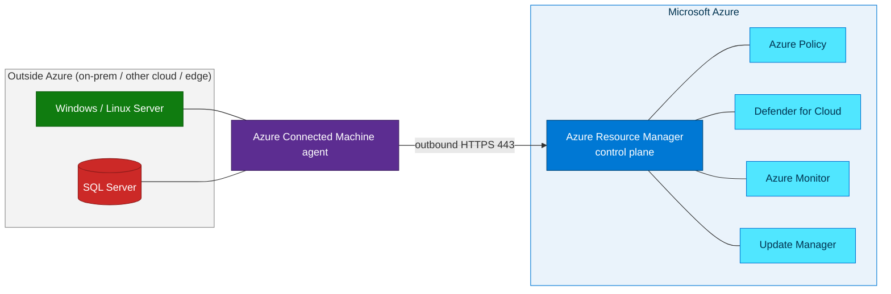

## Workshop labs

Six progressive levels (L100 → L500). Beginners can start at L100; experienced
practitioners can jump straight to the L400/L500 build labs.



  <a class="lab-card" href="{{ lab.url | relative_url }}">
    L{{ lab.level }}
    
{{ lab.title }}

    
{{ lab.excerpt }}

  </a>


## What you will learn

This workshop takes you from zero knowledge to a fully working hands-on lab.

*The Azure Arc control plane projects resources hosted outside Azure into Azure Resource Manager. Source: Microsoft Learn.*

## Who is this for?

- **IT professionals / infrastructure admins** new to Azure Arc (L100–L200).
- **Cloud engineers and architects** who want a repeatable, scriptable build (L300–L400).

## Prerequisites

- An **Azure subscription** with permission to create resource groups and resources.
- **Owner** or **Contributor** + **User Access Administrator** on the target scope.
- [Azure CLI](https://learn.microsoft.com/cli/azure/install-azure-cli) 2.53+ (or [Azure Cloud Shell](https://shell.azure.com)).
- Basic familiarity with the Azure portal and a terminal.

This workshop targets the **Indonesia Central** (`indonesiacentral`) region so resource
metadata stays in-country. You can substitute any
[supported Arc region](https://learn.microsoft.com/azure/azure-arc/servers/overview#supported-regions).
{: .notice--info}

## How Azure Arc works, in one minute

[Begin with Lab 01 → Azure Arc Overview]({{ '/labs/01-arc-overview/' | relative_url }}){: .btn .btn--primary .btn--large}
