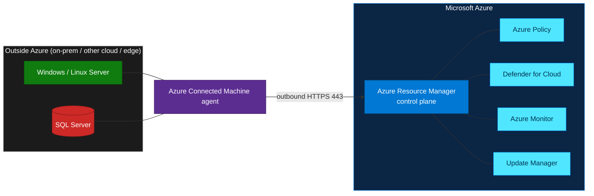

# Azure Arc Workshop (L100–L400)
{: .fs-8 }

Learn how to extend Azure management, governance, and security to servers and
SQL Server instances running **anywhere** — on-premises, at the edge, or in other
clouds — using **Azure Arc**.
{: .fs-5 .fw-300 }

[Start the workshop](labs/01-arc-overview){: .btn .btn-primary .fs-5 .mb-4 .mb-md-0 .mr-2 }
[View on GitHub](https://github.com/ibranibeny/azure-arc-workshop){: .btn .fs-5 .mb-4 .mb-md-0 }

---

## What you will learn

This workshop takes you from zero knowledge to a fully working hands-on lab. It is
organized into four progressive levels (L100 → L400). Beginners can start at L100;
experienced practitioners can jump straight to the L400 build lab.

*The Azure Arc control plane projects resources hosted outside Azure into Azure Resource Manager. Source: Microsoft Learn.*

## Workshop labs

| Lab | Level | Type | Duration | What you'll do |
|-----|-------|------|----------|----------------|
| [01 · Azure Arc Overview](labs/01-arc-overview) | **L100** | Concept | 20 min | Understand what Azure Arc is and the control-plane model |
| [02 · The Value of Azure Arc](labs/02-arc-value) | **L200** | Concept | 25 min | Explore governance, security, and management value |
| [03 · Onboard Windows Server & SQL Server](labs/03-onboard-windows-sql) | **L300** | How-to | 40 min | Connect a machine and its SQL Server to Azure Arc |
| [04 · Simulate a Windows + SQL VM into Arc](labs/04-simulate-vm-sql-arc) | **L400** | Lab | 60 min | Deploy and onboard a full simulated environment with `az` CLI |

## Who is this for?

- **IT professionals / infrastructure admins** new to Azure Arc (L100–L200).
- **Cloud engineers and architects** who want a repeatable, scriptable build (L300–L400).

## Prerequisites

- An **Azure subscription** with permission to create resource groups and resources.
- **Owner** or **Contributor** + **User Access Administrator** on the target scope
  (needed to register resource providers and create role assignments in L400).
- [Azure CLI](https://learn.microsoft.com/cli/azure/install-azure-cli) 2.53+ installed locally
  (or use [Azure Cloud Shell](https://shell.azure.com)).
- Basic familiarity with the Azure portal and a terminal.

{: .note }
> This workshop targets the **Indonesia Central** (`indonesiacentral`) Azure region so
> that resource metadata stays in-country. You can substitute any
> [supported Arc region](https://learn.microsoft.com/azure/azure-arc/servers/overview#supported-regions).

## How Azure Arc works, in one minute

Ready? **[Begin with Lab 01 → Azure Arc Overview](labs/01-arc-overview){: .btn .btn-primary }**
